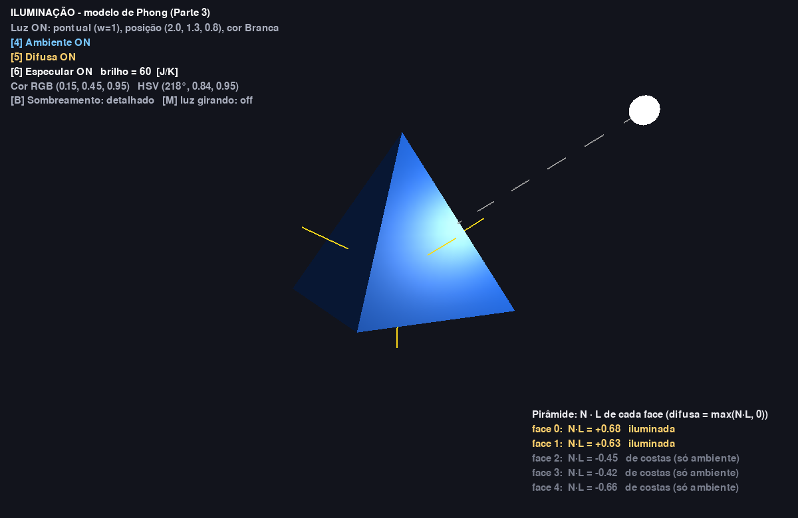
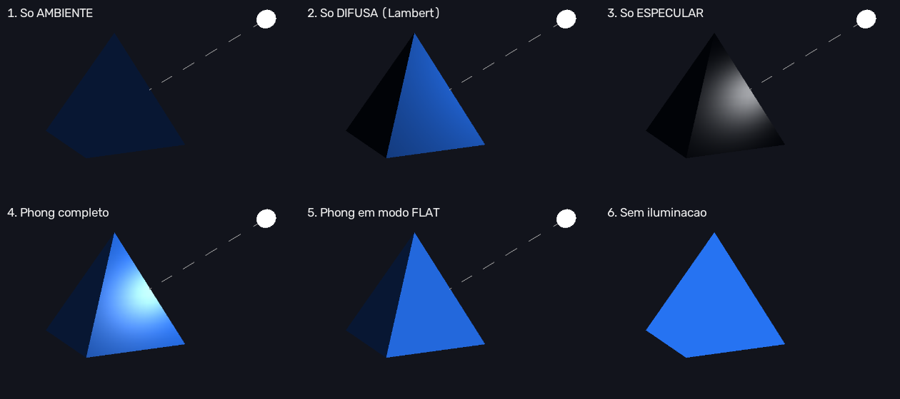
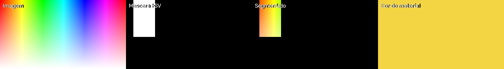
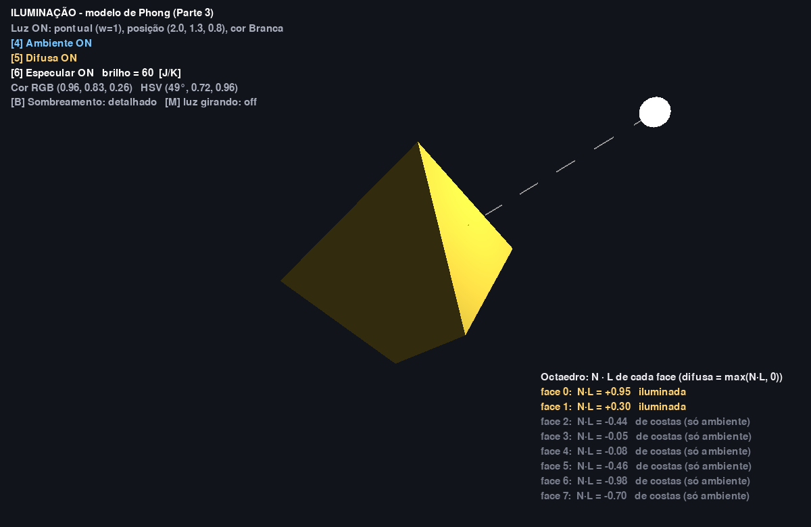
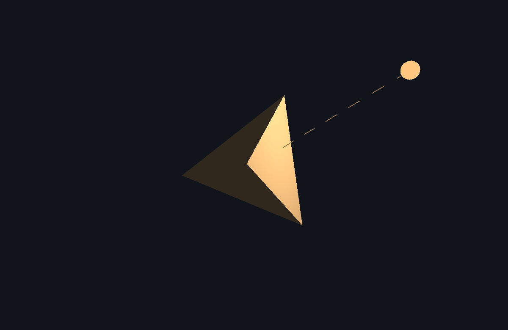

# Aplicação Interativa 3D — Computação Gráfica e Visão Computacional

Aplicação em **Python 3** que junta tudo o que vimos nas aulas:
- modelagem de sólidos por vértices e faces;
- transformações com matrizes 4×4;
- iluminação (ambiente, difusa e especular);
- cores RGB/HSV com **OpenCV**;
- **trackball com quatérnios** para girar o objeto com o mouse.

**Tecnologias:** Python 3 · PyOpenGL · Pygame · OpenCV (`cv2`) · NumPy



---

## Como executar

### Ubuntu / Linux — primeira vez
```bash
sudo apt install python3-venv python3-pip libglu1-mesa git
git clone https://github.com/VinnNyY/trabalho-cg-3d.git
cd trabalho-cg-3d
python3 -m venv .venv
source .venv/bin/activate
pip install -r requirements.txt
python src/main.py
```

### Para reabrir depois
```bash
cd trabalho-cg-3d
source .venv/bin/activate
python src/main.py
```

### Windows
```powershell
git clone https://github.com/VinnNyY/trabalho-cg-3d.git
cd trabalho-cg-3d
python -m venv .venv
.venv\Scripts\Activate.ps1
pip install -r requirements.txt
python src/main.py
```

### Outros comandos
```bash
pytest                                  # roda os testes da parte matemática
python src/main.py --imagem foto.jpg    # usa uma foto sua na análise de cor
```

| Problema | Solução |
|---|---|
| `Comando 'python' não encontrado` | Ative o ambiente: `source .venv/bin/activate` |
| `No module named ...` ou `can't open file` | Entre na pasta do projeto: `cd trabalho-cg-3d` |
| Janela do OpenCV (tecla `V`) reclama do Qt/Wayland | `QT_QPA_PLATFORM=xcb python src/main.py` |

---

## Controles

| Tecla | Ação |
|---|---|
| **Arrastar o mouse** | Gira o objeto (trackball com quatérnios) |
| Roda do mouse | Zoom |
| `1` `2` `3` | Pirâmide / Octaedro / Tetraedro |
| Setas, `PgUp` `PgDn` | Translação (matriz **T**) |
| `X` `Y` `Z` (Shift inverte) | Rotação nos eixos (matrizes **Rx Ry Rz**) |
| `+` `-` | Escala (matriz **S**) |
| **Iluminação** | |
| `L` | Liga/desliga a iluminação |
| `4` `5` `6` | Liga/desliga **ambiente**, **difusa** e **especular** |
| `J` `K` | Menos / mais brilho especular |
| `Shift` + setas, `Shift` + `PgUp`/`PgDn` | Move a luz |
| `M` | Luz girando em volta do objeto |
| `U` | Luz pontual / direcional |
| `7` | Cor da luz |
| `B` | Sombreamento detalhado / flat |
| **Cores** | |
| `Q`/`A`, `W`/`S`, `E`/`D` | Mais/menos vermelho, verde, azul (RGB) |
| `H` | Muda a matiz (HSV) |
| `O` | Usa a cor que veio da máscara do OpenCV |
| `[` `]` | Muda a faixa de cor da máscara |
| `V` | Abre a janela do OpenCV |
| **Outros** | |
| `N` | Mostra as normais |
| `F` | Wireframe |
| `G` | Eixos X, Y, Z |
| `I` | Esconde/mostra o painel de texto |
| `Espaço` | Rotação automática |
| `R` | Reinicia |
| `Esc` | Sai |

---

## Organização do código

```
trabalho-cg-3d/
├── src/
│   ├── main.py            # janela (pygame), câmera, desenho, teclado e mouse
│   ├── geometria.py       # Parte 1: vértices e faces | Parte 3: normais
│   ├── transformacoes.py  # Parte 2: matrizes T, R, S e composição
│   ├── iluminacao.py      # Parte 3: luz ambiente, difusa e especular
│   ├── cores.py           # Parte 3: RGB, HSV e máscara com OpenCV
│   └── quaternios.py      # Parte 4: quatérnios e trackball
├── tests/
│   └── test_matematica.py # testes das contas de cada parte
├── docs/                  # imagens do README
├── requirements.txt
└── .gitignore             # ignora a pasta .venv/
```

---

## Parte 1 — Estrutura e modelagem (Aulas 0_0, 1_0, 1_1, 6_0, 6_1)

- **Janela e OpenGL:** `inicializar()` em `main.py` abre a janela com pygame, liga o `GL_DEPTH_TEST` e configura a perspectiva com `gluPerspective`.
- **Sólidos:** em `geometria.py`, cada sólido é uma lista de vértices mais uma lista de faces com os índices dos vértices, como na Aula 6_0.
- **Desenho:** `desenhar_solido()` usa `GL_TRIANGLES` nas faces triangulares e `GL_QUADS` na base da pirâmide.

```python
PIRAMIDE_FACES = [
    (0, 1, 4),       # frente
    (1, 2, 4),       # direita
    (2, 3, 4),       # trás
    (3, 0, 4),       # esquerda
    (0, 3, 2, 1),    # base (quadrado -> GL_QUADS)
]
```

## Parte 2 — Transformações (Aulas 2_0, 3_0, 4_0)

- **Matrizes:** em `transformacoes.py`, cada transformação é uma matriz 4×4 em coordenadas homogêneas, feita com `np.array`: `matriz_translacao`, `matriz_escala`, `matriz_rotacao_x/y/z`.
- **Composição:** `M = T @ R @ S`. A matriz da direita age primeiro: o objeto escala, depois gira em torno do próprio centro e só então é transladado.
- **Câmera:** `gluLookAt` cria a Matriz de Visão (Mundo → Câmera).
- **Objeto:** `glMultMatrixf(M.T)` aplica a Matriz de Modelo (Objeto → Mundo). Usamos a transposta porque o NumPy guarda a matriz por linhas e o OpenGL lê por colunas.

## Parte 3 — Normais, iluminação e cor (Aulas 2_0, 5_0, 5_1, 6_0)



**Normais**
- `calcular_normal()` faz `N = (V1 − V0) × (V2 − V0)` com `np.cross` e divide pelo tamanho para que `|N| = 1`.
- Cada face recebe sua normal com `glNormal3fv()` antes dos vértices.

**Iluminação** (`iluminacao.py`)
- `glEnable(GL_LIGHTING)` e `glEnable(GL_LIGHT0)` ligam o sistema de luz.
- As três componentes da luz são definidas com `glLightfv`:
  - **Ambiente:** ilumina tudo igual. Sozinha, o objeto fica "chapado" (imagem 1).
  - **Difusa:** depende de `N · L`, o ângulo entre a normal e a luz. Mostra o volume do objeto (imagem 2).
  - **Especular:** o reflexo brilhante, que depende de onde está a câmera (imagem 3).
- A posição da luz é definida logo depois do `gluLookAt`. Assim a luz fica parada no mundo e as faces mudam de tom quando o objeto gira.
- O painel no canto da tela mostra o `N · L` de cada face em tempo real. Quando o valor é negativo, a face está de costas para a luz e recebe só a componente ambiente.
- O **modo detalhado** (tecla `B`) existe porque o OpenGL calcula a luz só nos vértices. `dividir_triangulo()` divide cada face em triângulos menores com a mesma normal, então a luz é calculada em mais pontos e o brilho especular aparece no meio da face.

**Cores** (`cores.py`)
- `rgb_para_hsv()` implementa as fórmulas da aula. O terminal mostra o resultado ao lado do `cv2.cvtColor` para comparar.
- A máscara usa `cv2.inRange` com limites de matiz e saturação. `cv2.mean` com a máscara calcula a cor média, que vira o material do objeto (tecla `O`).



| Cor vinda da máscara do OpenCV | Luz quente em material branco |
|---|---|
|  |  |

## Parte 4 — Quatérnios e Trackball (Aula 7_0)

Tudo está em `quaternios.py`. O quatérnio é uma tupla `(w, x, y, z)`. A cada movimento do mouse:

1. `mapear_para_esfera()` converte a posição do mouse em um ponto `(x, y, z)` sobre um hemisfério de raio 1: `z = √(1 − x² − y²)`.
2. `rotacao_do_arraste()` calcula:
   - **eixo** = ponto anterior × ponto atual (produto vetorial);
   - **ângulo** = `acos` do produto escalar entre os dois pontos.
3. O quatérnio do arraste é multiplicado pela orientação acumulada (`multiplicar`) e normalizado.
4. `quaternio_para_matriz()` gera a matriz 4×4 que entra no lugar de `R` em `M = T @ R @ S`.

**Gimbal Lock:** com ângulos de Euler, depois de girar 90° em Y, girar em X ou em Z dá o mesmo resultado e perde-se um eixo. O teste `test_sem_gimbal_lock` mostra isso acontecendo com as matrizes e mostra que com quatérnios não acontece.

---

## Roteiro para a apresentação

1. `python src/main.py`: abre a pirâmide iluminada. Arraste com o mouse (**trackball**).
2. Aperte `5` e `6` para ficar só com a **ambiente**. Religue a `5` (**difusa**) e depois a `6` (**especular**).
3. Aperte `N` para mostrar as normais e aponte no painel o `N · L` de cada face.
4. Aperte `M` para a luz girar e as faces mudarem de tom. Mostre também `U`, `7`, `J`/`K` e `B`.
5. Use setas, `X`/`Y`/`Z` e `+`/`-` para aplicar as matrizes **T, R, S**.
6. Use `Q`…`D` e `H` para mudar a cor. O terminal mostra **RGB → HSV** (nossa conversão e a do OpenCV).
7. Aperte `V` para abrir o OpenCV e `[` `]` para mudar a máscara. O objeto assume a cor segmentada.
8. Para fechar, rode `pytest`.
