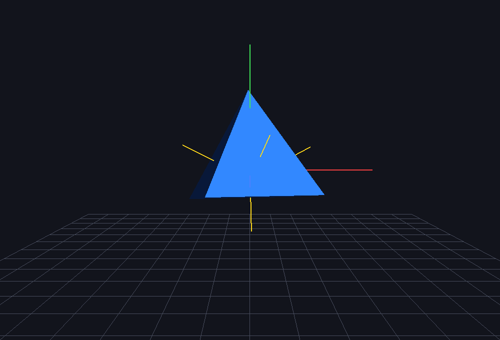
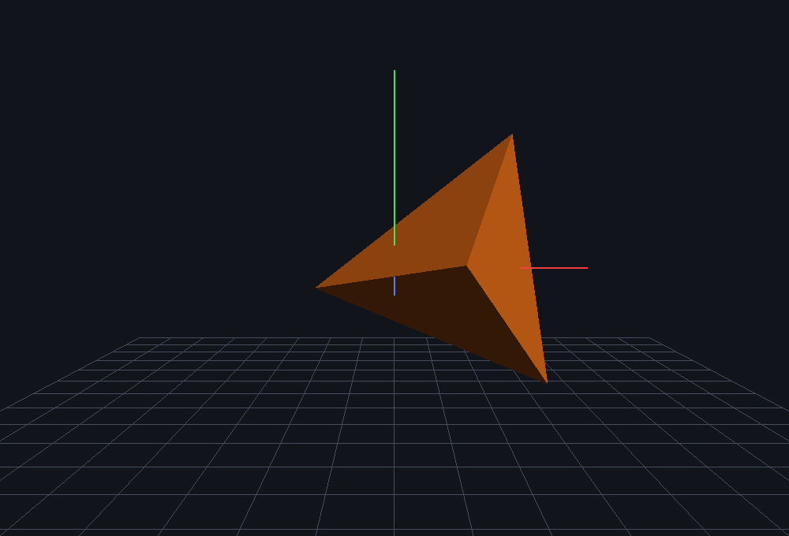
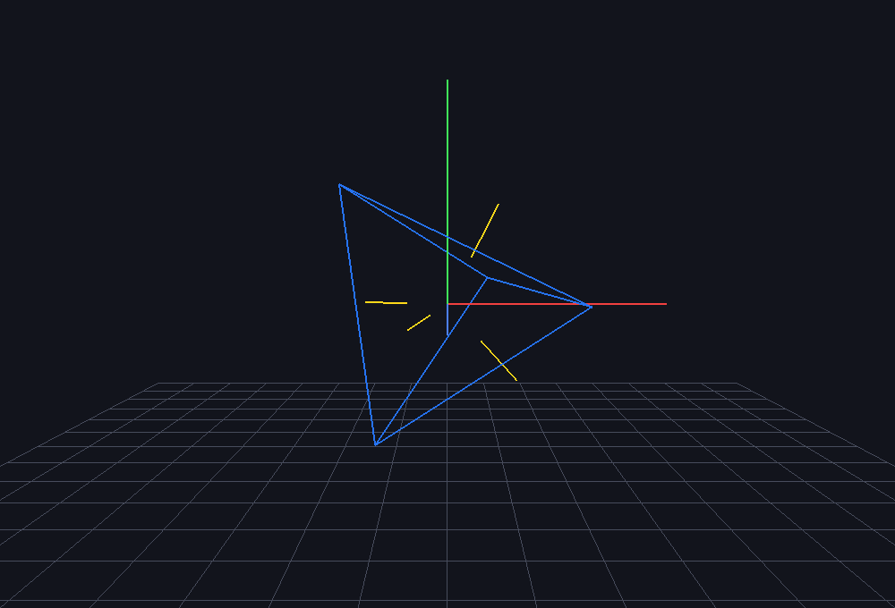

# Aplicação Interativa 3D — Computação Gráfica e Visão Computacional

Aplicação em **Python 3** que integra modelagem geométrica por malha poligonal, transformações em coordenadas homogêneas, iluminação de Phong, modelos de cor RGB/HSV com análise no **OpenCV** e um **Trackball virtual com quatérnios** para girar o objeto com o mouse.

**Tecnologias:** Python 3 · PyOpenGL · GLFW · OpenCV (`cv2`) · NumPy · pytest

| Pirâmide com normais | Octaedro com cor vinda do OpenCV |
|---|---|
|  |  |
| **Tetraedro com T·R·S aplicada** | **Wireframe + normais** |
|  |  |

Painel de análise HSV do OpenCV (imagem → máscara → segmentação → cor aplicada como material):


---

## Como executar

```bash
git clone <url-deste-repositorio>
cd trabalho-cg

python -m venv .venv
# Linux/macOS:
source .venv/bin/activate
# Windows (PowerShell):
.venv\Scripts\Activate.ps1

pip install -r requirements.txt
python src/main.py
```

Opcional — usar uma foto sua na análise de cor:

```bash
python src/main.py --imagem minha_foto.jpg
```

Rodar os testes automatizados da parte matemática (112 testes):

```bash
pytest
```

---

## Estrutura do repositório

```
trabalho-cg/
├── src/
│   ├── main.py                 # ponto de entrada
│   └── cg3d/
│       ├── app.py              # janela GLFW, contexto OpenGL, laço, callbacks   (Partes 1–4)
│       ├── geometry.py         # vértices/faces dos sólidos + normais             (Partes 1 e 3)
│       ├── renderer.py         # desenho com GL_TRIANGLES / GL_QUADS, eixos, normais
│       ├── transforms.py       # T, S, Rx, Ry, Rz, lookAt, perspective, frustum   (Parte 2)
│       ├── lighting.py         # GL_LIGHTING, GL_LIGHT0, ambiente/difusa/especular (Parte 3)
│       ├── color.py            # RGB↔HSV, máscara HSV e cor média com OpenCV     (Parte 3)
│       ├── quaternion.py       # quatérnios unitários e conversão para matriz 4×4  (Parte 4)
│       └── trackball.py        # mapeamento 2D → hemisfério e rotação do mouse    (Parte 4)
├── tests/                      # pytest: valida toda a matemática do trabalho
├── docs/                       # imagens geradas pela própria aplicação
├── requirements.txt
├── pytest.ini
└── .gitignore                  # ignora .venv/, __pycache__/ etc.
```

---

## Controles

| Entrada | Ação |
|---|---|
| **Arrastar com o botão esquerdo** | Trackball virtual (quatérnios) |
| Roda do mouse | Zoom da câmera |
| `1` `2` `3` | Pirâmide / Octaedro / Tetraedro |
| Setas · `PgUp` `PgDn` | Translação em X, Y · Z (matriz **T**) |
| `X` `Y` `Z` (Shift inverte) | Rotação nos eixos principais (**Rx Ry Rz**) |
| `+` `-` | Escala uniforme (matriz **S**) |
| `Q`/`A` · `W`/`S` · `E`/`D` | Aumenta/diminui os canais **R · G · B** |
| `H` | Gira o matiz +20° no espaço **HSV** |
| `O` | Usa a cor da máscara HSV do OpenCV como material |
| `[` `]` · `,` `.` · `;` `'` | Máscara: desloca matiz · largura da faixa · saturação mínima |
| `V` | Abre/fecha a janela de análise do OpenCV |
| `L` | Liga/desliga a iluminação |
| Shift + Setas | Move a fonte de luz |
| `N` · `F` · `G` · `C` | Normais · Wireframe · Eixos/grade · Back-face culling |
| `Espaço` | Rotação automática (composição incremental de quatérnios) |
| `T` | Compara as matrizes sintéticas com `gluLookAt`/`gluPerspective` |
| `P` | Salva screenshot da cena e do painel do OpenCV |
| `R` · `Esc` | Reinicia · Sai |

A barra de título mostra em tempo real o modelo, o quatérnio de orientação `q = (w, x, y, z)`, a cor em RGB e HSV e os limites da máscara. Cada mudança de cor imprime no terminal a conversão RGB→HSV **feita à mão** lado a lado com a do **`cv2.cvtColor`**.

---

## Onde cada requisito foi atendido

### Parte 1 — Estrutura, ambiente e modelagem base
| Requisito | Implementação |
|---|---|
| `src/`, `requirements.txt`, `.gitignore` ignorando `.venv/` | raiz do repositório |
| Contexto via GLFW + `GL_DEPTH_TEST` | `App.init_window()` e `App._init_gl()` em `app.py` |
| Sólido definido por listas de vértices e faces | `pyramid()`, `octahedron()`, `tetrahedron()` em `geometry.py` |
| Malha com `GL_TRIANGLES` / `GL_QUADS` | `draw_mesh()` em `renderer.py` — a pirâmide usa **os dois**: laterais em triângulos e base em quad |

Todas as faces estão em ordem **anti-horária vista de fora**, o que os testes comprovam (normais para fora, malha fechada, Euler `V − A + F = 2`). Isso permite ligar o back-face culling sem buracos.

### Parte 2 — Transformações e espaços de coordenadas
| Requisito | Implementação |
|---|---|
| Matrizes 4×4 `T`, `S`, `Rx`, `Ry`, `Rz` | `translation`, `scale`, `rotation_x/y/z` em `transforms.py` |
| Composição `M = T · R · S` | `model_matrix()` em `transforms.py`; `App.model_matrix()` |
| Objeto → Mundo (Modelo) e Mundo → Câmera (Visão) | `App.model_matrix()` e `look_at()` (matriz sintética) |
| Perspectiva | `perspective()` e `frustum()` (sintéticas) |

As matrizes são escritas em NumPy como no quadro (vetor coluna) e enviadas ao OpenGL com `glLoadMatrixf(M.T)` — o OpenGL é coluna-maior. Pipeline por quadro:

```
PROJECTION ← P
MODELVIEW  ← V          → posiciona a luz no espaço do mundo
MODELVIEW  ← V · M      → desenha o objeto
```

**Por que a ordem importa:** como o vértice é multiplicado à direita, `S` age primeiro, depois `R`, depois `T`. O objeto escala e gira em torno do próprio centro e só então é levado à posição. Invertendo (`R · T`), a rotação ocorre em torno da origem do mundo e o objeto "orbita" — o teste `test_ordem_importa` demonstra isso numericamente.

### Parte 3 — Normais, iluminação e cor
| Requisito | Implementação |
|---|---|
| `N = (V1 − V0) × (V2 − V0)` normalizado | `face_normal()` em `geometry.py` |
| `glNormal3fv()` por face | `draw_mesh()` em `renderer.py` |
| `GL_LIGHTING` + `GL_LIGHT0`, ambiente/difusa/especular | `setup_lighting()`, `place_light()`, `apply_material()` em `lighting.py` |
| Cor dinâmica em RGB e conversão para HSV | teclas `Q A W S E D H`; `rgb_to_hsv()` / `hsv_to_rgb()` em `color.py` |
| OpenCV: máscara por limites de matiz/saturação → material | `hsv_mask()` (`cv2.inRange`), `mask_mean_color()` (`cv2.mean` com máscara) |

Detalhes que fazem diferença:
* `GL_NORMALIZE` está ligado porque a escala `S` altera o comprimento das normais.
* A luz é posicionada **depois** da Matriz de Visão, então fica fixa no mundo enquanto o objeto gira — as faces mudam de tom conforme o ângulo com a luz.
* A máscara HSV trata faixas que "dão a volta" no vermelho (ex.: H de 170 a 10) unindo duas máscaras.

### Parte 4 — Quatérnios e Trackball
| Requisito | Implementação |
|---|---|
| Capturar clique e arraste | `_on_mouse_button()` e `_on_cursor()` em `app.py` |
| `(x, y)` da tela → `(x, y, z)` no hemisfério | `screen_to_ndc()` + `project_to_sphere()` em `trackball.py` |
| Eixo por produto vetorial, ângulo por produto escalar | `rotation_between()` em `trackball.py` |
| Quatérnio unitário `q = (w, x, y, z)` | `Quaternion.from_axis_angle()` em `quaternion.py` |
| Acumular: `q_total = q_novo · q_total` | `Trackball.drag()` (com renormalização) |
| Converter para 4×4 e enviar ao pipeline | `Quaternion.to_matrix()` → entra em `R` da matriz de modelo |

Mapeamento para o hemisfério (raio 1):

```
x² + y² ≤ 1  →  z = √(1 − x² − y²)
caso contrário →  (x, y) normalizado, z = 0   (borda: gira em torno do eixo de visão)
```

**Gimbal lock:** com ângulos de Euler, depois de 90° em Y as rotações em X e Z passam a produzir o mesmo movimento — perde-se um grau de liberdade. O teste `test_sem_gimbal_lock` mostra isso acontecendo com as matrizes da Parte 2 e mostra que, com quatérnios, as duas rotações continuam distintas.

---

## Fidelidade matemática — testes automatizados

`pytest` executa 112 verificações, entre elas:

* rotações de 90° seguem a regra da mão direita; matrizes de rotação são ortonormais (`RRᵀ = I`, `det = 1`);
* `look_at` leva o olho para a origem e o alvo para −Z; `perspective` leva *near*→−1 e *far*→+1 no NDC e coincide com `frustum` simétrico;
* todas as normais têm `|N| = 1` e apontam para fora; faces quadrilaterais são planas; malhas fechadas e orientadas;
* `Quaternion.to_matrix()` é **idêntica** a `Rx/Ry/Rz` para 0°, 30°, 90°, 180°, 270°; `i·j = k`, `j·i = −k`; composição de quatérnios = produto de matrizes;
* 100 000 composições seguidas mantêm `|q| = 1` (renormalização);
* trackball: arrastar para a direita gira em +Y, para cima em −X, e ida-e-volta retorna à identidade;
* RGB→HSV manual confere com `colorsys` **e** com `cv2.cvtColor` (tolerância de 1 nível em 8 bits).

---

## Roteiro sugerido para a demonstração em sala

1. `python src/main.py` — pirâmide azul iluminada; arraste com o mouse (**trackball**).
2. `N` mostra as normais; `F` alterna wireframe; `C` desliga o culling.
3. `Shift + setas` move a luz: o sombreamento das faces muda (**difusa/especular**).
4. Setas, `X`/`Y`/`Z` e `+`/`-` aplicam **T, R, S**; `R` reinicia.
5. `Q`…`D` e `H` mudam a cor; o terminal imprime **RGB → HSV** manual × OpenCV.
6. `V` abre o painel do OpenCV; `[` `]` deslocam a faixa de matiz e o objeto assume a **cor média segmentada**.
7. `2` e `3` trocam para octaedro e tetraedro; `Espaço` liga a rotação automática por quatérnios.
8. Para fechar, rode `pytest` para mostrar as 112 verificações passando.

> Observação: no Linux, se a janela do OpenCV não abrir, provavelmente está instalado o `opencv-python-headless`. Use `pip install opencv-python` ou a tecla `P` para salvar o painel em arquivo.
